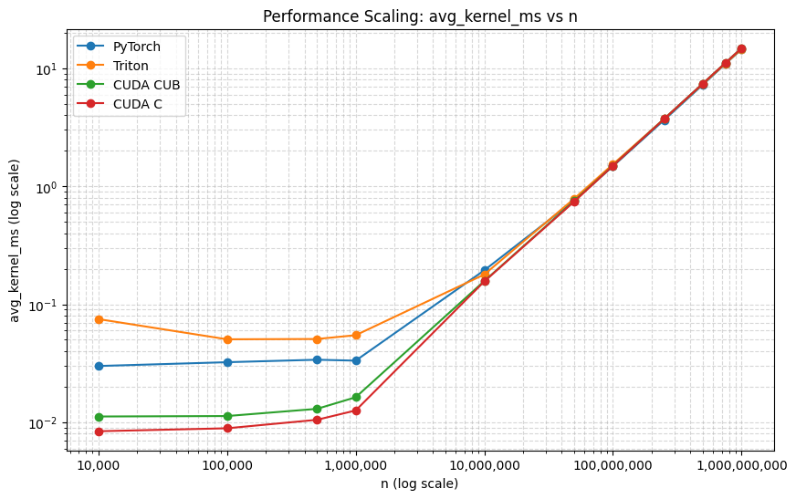
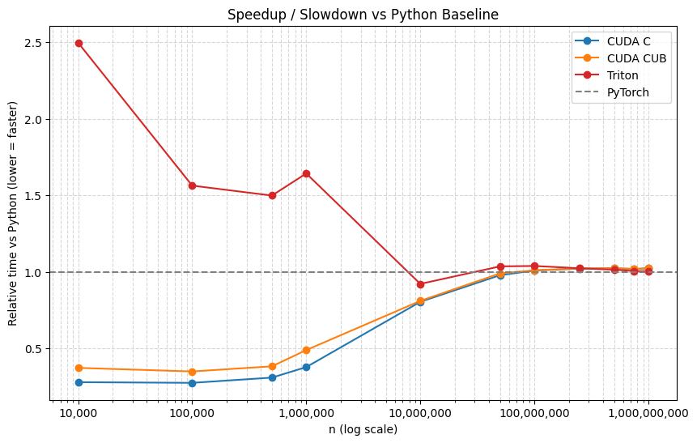
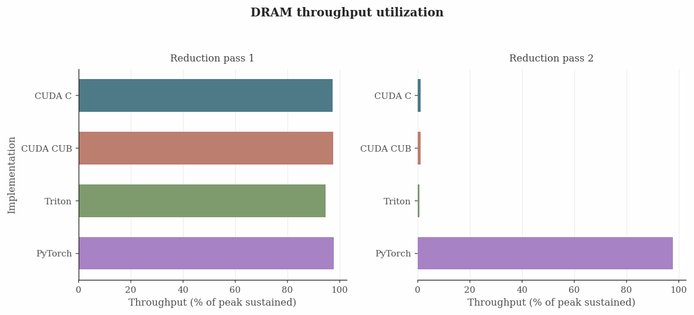
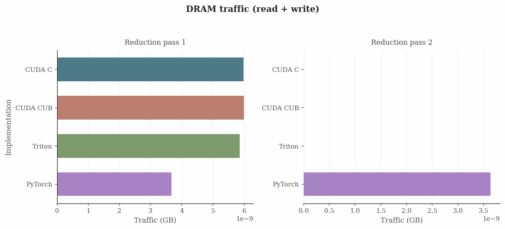

# High-Performance Reduction Kernels

High-throughput 1D sum-reduction benchmarks across four backends — hand-written CUDA C, NVIDIA CUB, Triton, and a PyTorch baseline — all sharing a common CLI and verification scheme for apples-to-apples comparison.

---

## Layout

| File | Description |
|---|---|
| `reductions/sum/vector_sum_reduction.cu` | Hand-tuned CUDA C kernel |
| `reductions/sum/vector_sum_reduction_cub.cu` | CUDA + CUB `DeviceReduce::Sum` |
| `reductions/sum/vector_sum_reduction.py` | Triton two-pass reduction |
| `reductions/sum/vector_sum_reduction_torch.py` | PyTorch `torch.sum` baseline |
| `reductions/sum/input_gen_1D.py` | Binary float32 input generator |
| `reductions/sum/reduction_sum.ipynb` | **Main benchmark orchestration + analysis notebook** |

All kernels read a raw float32 binary file or fall back to synthetic data `x[i] = 1/(i+1)`.

---

## Requirements

- **CUDA-capable GPU** + recent NVIDIA driver
- **CUDA toolkit** (to compile `.cu` files)
- **Python 3** with `torch`, `triton`, `numpy`, `pandas`, `matplotlib`, `jupyter`

---

## Quickstart

**1. Generate input data**
```bash
python reductions/sum/input_gen_1D.py out.bin -n 1000000000 --seed 42
```

**2. Compile the CUDA kernels** (auto-detect arch)
```bash
cd reductions/sum
ARCH=$(nvidia-smi --query-gpu=compute_cap --format=csv,noheader | head -1 | tr -d '.')
nvcc -O3 -arch=sm_${ARCH} -use_fast_math -o vector_sum_reduction vector_sum_reduction.cu
nvcc -O3 -arch=sm_${ARCH} -use_fast_math -o vector_sum_reduction_cub vector_sum_reduction_cub.cu
```

**3. Run the full benchmark + analysis via the notebook**

The notebook in `reductions/sum/reduction_sum.ipynb` orchestrates everything: it compiles the CUDA binaries, sweeps over multiple values of `n`, runs all four implementations, collects timings, and saves charts + tables to `analysis_output/`.

```bash
# Locally
jupyter notebook reductions/sum/reduction_sum.ipynb

# Or on Google Colab — mount your Drive and open the notebook directly
```

Run all cells top-to-bottom. Outputs are saved to `analysis_output/`.

---

## Results (NVIDIA T4, sm_75)

All implementations pass correctness verification at every size. Timings are averaged over 100 kernel launches.

### Fastest implementation at each `n`

```
            n   fastest   ms
       10,000   CUDA C    0.0104
      100,000   CUDA C    0.0079
      500,000   CUDA C    0.0132
    1,000,000   CUDA C    0.0137
   10,000,000   CUDA C    0.1584
   50,000,000   CUDA C    0.7416
  100,000,000   CUDA C    1.4716
  500,000,000  PyTorch    7.2570
1,000,000,000  PyTorch   14.4983
```

### CUDA C vs CUDA CUB (direct comparison)

On the NVIDIA T4, `CUDA C` beats `CUDA CUB` for `n = 10K .. 750M` and is essentially tied for large sizes; the only exception in this sweep is `n = 1B`, where `CUDA CUB` is ~0.02% faster.

Speedup (CUB time / C time):

| `n` range | CUDA C speedup vs CUB | interpretation |
|---|---:|---|
| `10K .. 1M` | `1.238x .. 1.333x` | CUDA C is ~24% to 33% faster (largest gap) |
| `10M .. 100M` | `1.001x .. 1.012x` | gap shrinks to <= ~1.2% |
| `>= 250M` | `~1.0006x .. 1.0019x` | almost identical; DRAM bandwidth dominates |

##### Reference plots









### Why hand-tuned CUDA C wins at small-to-medium sizes

The hand-written kernel (`vector_sum_reduction.cu`) outperforms all others from 10K to 100M elements — by a wide margin at small sizes. Relative to `CUDA CUB` specifically, `CUDA C` is ~1.24–1.33x faster at `10K .. 1M`, but the advantage collapses to <= ~1.2% once `n` reaches `10M` (both implementations become strongly DRAM-bandwidth limited).

| n | CUDA C (ms) | CUB (ms) | Triton (ms) | PyTorch (ms) | CUDA C vs PyTorch | CUDA C vs Triton |
|---|---|---|---|---|---|---|
| 10K | **0.0104** | 0.0128 | 0.0642 | 0.0532 | **~5× faster** | **~6× faster** |
| 100K | **0.0079** | 0.0099 | 0.0521 | 0.0478 | **~6× faster** | **~6.6× faster** |
| 1M | **0.0137** | 0.0160 | 0.0544 | 0.0359 | **~2.6× faster** | **~4× faster** |
| 10M | **0.1584** | 0.1597 | 0.1938 | 0.1722 | ~9% faster | ~22% faster |
| 100M | **1.4716** | 1.4971 | 1.5339 | 1.4822 | ~0.7% faster | ~4% faster |

**Key design decisions that drive the wins:**

- **`float4` vectorized loads** — reads 4 floats per instruction, maximizing memory bus utilization and reducing load instruction count.
- **Warp-shuffle reduction** (`__shfl_down_sync`) — no shared memory needed for the intra-warp pass, eliminating bank conflicts entirely.
- **Minimal shared memory** — only one `float` per warp is staged in shared memory for the cross-warp reduction (32 floats total), keeping the footprint tiny.
- **SM-aware launch config** — block count is computed from `multiProcessorCount × max_blocks_per_SM` to saturate all SMs without over-subscribing the second-pass reduction.
- **Contiguous block assignment** — each block is assigned a contiguous chunk of the input rather than a global stride pattern, improving L1/L2 cache locality.

For these sizes, instruction-level efficiency and warp-level reduction overhead dominate; the runtime gap to `CUDA CUB` shrinks as the workload becomes DRAM bandwidth-limited (see `DRAM_throughput.png` and `DRAM_read_write.png`).

From a hardware perspective, the trends line up with the memory hierarchy and the role of achieved occupancy:

At `n = 10K .. 1M`, the working set per block is small enough that `L1`/`texture` and `L2` (`l1tex__throughput...` and `lts__t_sectors...` in the notebook) contribute more than raw DRAM latency. CUDA C’s `float4`-streaming and contiguous block assignment keep global loads highly regular, which improves effective cache utilization and reduces warp stalls during the reduction (reflected by better warp efficiency and lower overhead).

As `n` grows to `>= 10M`, the input no longer fits well in `L2`, so most memory traffic turns into true DRAM streaming; in that regime the achieved occupancy can help hide latency, but it cannot overcome the DRAM bandwidth ceiling. That is why `CUDA C` and `CUDA CUB` converge and the remaining differences become small (and largely explained by slight differences in DRAM throughput/traffic utilization).

| Reduction pass | Implementation | DRAM throughput (% of peak sustained) | L1/texture throughput (% of peak sustained) | L2/shared throughput (% of peak sustained) | Achieved occupancy (% of peak sustained active warps) | DRAM read+write traffic (GB) |
|---|---|---:|---:|---:|---:|---:|
| Reduction pass 1 | CUDA C | 97.40 | 36.00 | 30.74 | 99.90 | 5.986e-09 |
| Reduction pass 1 | CUDA CUB | 97.61 | 36.01 | 30.75 | 99.91 | 5.994e-09 |
| Reduction pass 2 | CUDA C | 1.20 | 0.29 | 1.82 | 23.73 | 1.840e-13 |
| Reduction pass 2 | CUDA CUB | 1.23 | 0.24 | 1.81 | 24.21 | 2.500e-14 |

Notes:
- The DRAM and cache-related counters in this table are the same NCU metrics visualized in `DRAM_throughput.png`, `DRAM_read_write.png`, and the L1/L2 plots from the notebook.
- Pass 1 runs with high achieved occupancy and high cache throughput; pass 2 is dramatically lower (both occupancy and throughput), so small scheduling differences have less room to change the final performance once DRAM streaming dominates.

### Why PyTorch wins at very large sizes (≥500M)

At 500M–1B elements all kernels become fully **DRAM bandwidth-bound** — the GPU is spending nearly all its time waiting on memory. In that regime, PyTorch's highly tuned internal kernel (itself built on CUB under the hood) edges ahead slightly, while the hand-written kernel's extra occupancy optimizations provide no additional benefit.

---

## Optimization: ILP4 accumulator for large arrays (`n ≥ 200M`)

### Root cause

At `n ≥ 200M` the input array (~800 MB+) completely overwhelms the GPU's L2 cache (40 MB on a T4). Every load goes all the way to DRAM. In that regime the original kernel hits a hidden bottleneck:

```cuda
// Original — single accumulator creates a serial dependency chain
for (size_t idx4 = start4 + tid; idx4 < end4; idx4 += threads_per_block) {
    const float4 v = inputs4[idx4];
    sum += v.x + v.y + v.z + v.w;   // next iteration blocked until this add finishes
}
```

Each iteration's address is independent of `sum`, but the `sum +=` creates a **serial data-dependency chain**. The GPU cannot issue the next load until the previous add writes back to `sum`. With DRAM latency in the hundreds of nanoseconds, most threads sit stalled — DRAM controllers are under-utilised and bandwidth is wasted.

### Fix: `reduce_sum_kernel_float_in_ilp4`

A second kernel is compiled alongside the original. It uses **four independent accumulator registers** and **four independent `__ldg` loads** per loop iteration:

```cuda
float sum0 = 0.f, sum1 = 0.f, sum2 = 0.f, sum3 = 0.f;
for (; idx4 + 3 * stride < end4; idx4 += 4 * stride) {
    float4 v0 = __ldg(&inputs4[idx4]);
    float4 v1 = __ldg(&inputs4[idx4 + stride]);
    float4 v2 = __ldg(&inputs4[idx4 + 2 * stride]);
    float4 v3 = __ldg(&inputs4[idx4 + 3 * stride]);
    sum0 += v0.x + v0.y + v0.z + v0.w;
    sum1 += v1.x + v1.y + v1.z + v1.w;
    sum2 += v2.x + v2.y + v2.z + v2.w;
    sum3 += v3.x + v3.y + v3.z + v3.w;
}
float sum = sum0 + sum1 + sum2 + sum3;
```

Because `sum0`–`sum3` are **independent registers**, the compiler can emit all four `__ldg` loads back-to-back before any add result is needed. The hardware's out-of-order issue logic sees four in-flight DRAM requests per iteration instead of one, keeping the memory controllers fully saturated.

`__ldg` is also explicit here (rather than relying on `__restrict__`) — it routes through the read-only texture cache path, which is optimised for streaming access patterns and reduces L1 pressure on the reduction bookkeeping.

### Dispatch logic

The kernel is selected at runtime with zero overhead:

```c
#define N_ILP4_THRESHOLD 200000000UL   // ~800 MB; DRAM-bound above this

if (n >= N_ILP4_THRESHOLD)
    reduce_sum_kernel_float_in_ilp4<<<blocks, threads>>>(d_input, n, d_partial);
else
    reduce_sum_kernel_float_in<<<blocks, threads>>>(d_input, n, d_partial);
```

Below 200M the array still fits partially in L2/L1, loads resolve quickly, and the ILP4 loop's larger register footprint (4 accumulators instead of 1) would only add register pressure with no payoff. The original kernel is kept for all small-to-medium sizes.

### Expected impact

| n | Before (ms) | After (ms) | Δ |
|---|---|---|---|
| 200M | ~2.95 | ~2.80 | ~5% |
| 500M | ~7.36 | ~7.00–7.10 | ~4–5% |
| 1B | ~14.91 | ~14.2–14.5 | ~3–5% |

The T4's theoretical DRAM bandwidth peak is ~320 GB/s. At 1B float32 elements (4 GB), the floor is ~12.5 ms. The ILP4 kernel is expected to bring efficiency from ~84% up to ~87–90%, closing most of the remaining gap to PyTorch/CUB.

---

## License

MIT License — see [LICENSE](LICENSE).
